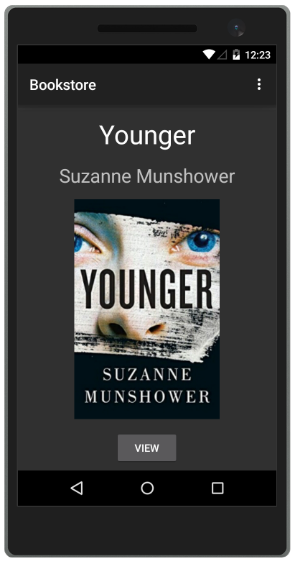
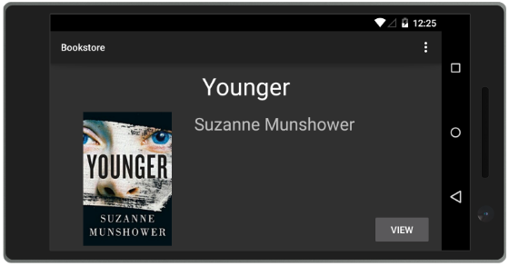
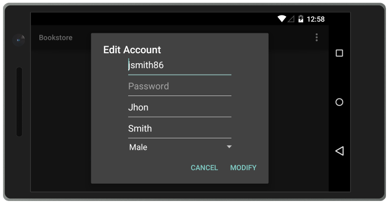

# Bookstore Android

Bookstore client application is built for Android platform which consumes the SOAP web service. All the service endpoints were consumed and a simple UI design was provided for the user. Extra functionality was required to maintain a good user experience while the screen orientation changes or keyboard shows.

## Introduction

The application is design to allow new members to join avirtual library and rent books for a fixed period of time. A new member is able to register or connect to the application. An account menu is provided to alter details and see the rented books. The main view shows the books available in the library or search through them usign the search box provided in the top-right corner. A book can be rented for a fixed period of time and there exists only one copy available.

## Requirements

- Java SDK v8
- Android Studio v2.0
- Android SDK v23 

## Installation

The client runs on Android platform and requires a physical device or a virtual device to run. Internet access is required on the device in order to send requests to the server application. 
 
The list below shows each step to compile, package and install the application.

**Note**: This instructions are platform independent which means that it will work on both Linux and Windows operating systems.

1.	Download and install **Android Studio 1.5.1** from the following link: www.developer.android.com
2.	Open the program and navigate to **File -> Open**. A new window will open to select the project folder.
3.	Locate the project folder and open it using the search window opened.
4.	The project requires **Android API Level 21** minimum. To install it, navigate to **Tools -> Android -> SDK Manager** and select the required API Level.
5.	Navigate to **Build -> Build APK**
6.	To see the result of the building process navigate to **View -> Tool Windows -> Event Log**

An Android Emulator can be created if there is no physical device available. Navigate to **Tools -> Android -> AVD Manager** and create a new device. For demonstration purposes, I will use an LG Nexus 5 device to show the client running.

## Screenshots

Screenshot 1

Screenshot 2

Screenshot 3

